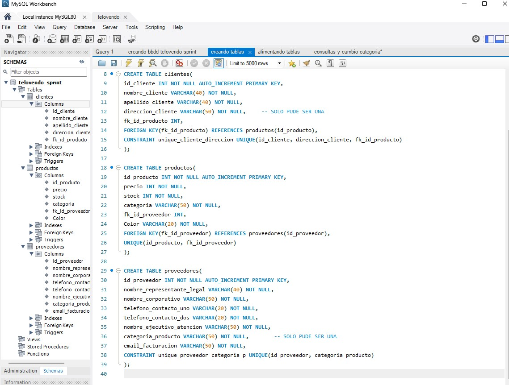

**_<h1 align="center">:vulcan_salute: Ejercicio Sprint :computer:</h1>_**
**_<h2 align="center">Módulo 3 - Fundamentos de Bases de Datos Relacionales</h2>_**

- Creación de base de datos y sus tablas
- Ingreso de datos
- Consultas

